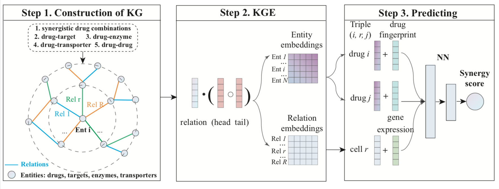

# KGE-DC
This is the implementation code of KGE, Knowledge Graph Embedding-based framework for predicting the synergistic effects of Drug Combinations. The framework is consisted of three critical steps: (1) Construction of the knowledge graph based on the drug combinations’ synergy data and DrugBank data; (2) Simultaneously learns low-dimensional representations for the entities and relations through knowledge graph embedding, so that the complex semantic information of entities is extracted; (3) Integrating multimodal information to predict the synergy scores of drug combinations. 



## Requirements
Python 3.8 or higher  
pandas 1.3.5  
numpy 1.21.2  
tensorflow 2.4.1    
libkge

## Datasets
(1) Drug combination’s synergy data. The benchmark dataset is merged from four commonly used datasets in the drug synergy prediction field including O'Neil, ALMANAC, CLOUD and FORCINA datasets. The synergistic effects of drug combinations in the benchmark dataset are quantified by four synergy types namely Loewe additivity (Loewe), Bliss independence (Bliss), zero interaction potency (ZIP), and highest single agent (HSA), respectively. 

(2) DrugBank data. The dataset is downloaded from the DrugBank database, which collects vast bioinformatic and chemical data sources for drugs. We extract the linked data between the targets, enzymes and transporters with the drugs involved in the benchmark dataset. In particular, we obtain 2049 drug-target interactions, 1510 drug-enzyme interactions, 794 drug-transporter interactions and 20428 drug-drug interactions. (This part of data are not accessible beacause of the policay in the DrugBank database.)


## Training
python get_kgedc_loewe.py -lr1 0.01 -epochs1 300 -embedding_size 200  -lr2 0.01 -epochs2 500 -drop_out 0.2 -hidden 8192

python get_kgedc_bliss.py -lr1 0.01 -epochs1 300 -embedding_size 200  -lr2 0.01 -epochs2 500 -drop_out 0.2 -hidden 8192

python get_kgedc_zip.py -lr1 0.01 -epochs1 300 -embedding_size 200  -lr2 0.01 -epochs2 500 -drop_out 0.2 -hidden 8192

python get_kgedc_hsa.py -lr1 0.01 -epochs1 300 -embedding_size 200  -lr2 0.01 -epochs2 500 -drop_out 0.2 -hidden 8192

## Default parameters of the scripts
|Argument|Default|Description|
|---|---|----|
| l1|  0.01|  Initial learning rate in the KGE model|
| epochs1 |  1|  The number of training epochs in the KGE model. |
| embedding_size |  200|  The number of dimension for entity and relation embeddings in the KGE model|
| l2|  0.01|  Initial learning rate in the NN model|
| epochs2 |  1|  The number of training epochs in the NN model|
| dropout|  0.2|  Dropout rate (1 - keep probability) |
| hidden |  8192|  the number of hidden units in the NN model |


## Predicting with pretrained model
python get_kgedc_load_pretrainmodel.py -modelfile ../trained_model/best_model.ckpt  

The script is used to predict with the pretrained KGEDC model on the ONEIL datasets. The size of pretrained models are too large, so they are accessible with baidu netdisk [links ](https://pan.baidu.com/s/1W7958n5K_5J4xEXW_RcrHA ), code: 8id4.


## Contact us
pengzhang2020@sjtu.edu.cn

## Reference
Please cite our work if you find our code/paper is useful to your work.

```   
@article{Zhang, 
title={A knowledge graph embedding-based framework for predicting the synergistic effects of drug combinations}, 
author={Peng Zhang, Shikui Tu}, 
journal={}, 
volume={}, 
number={}, 
year={2022}, 
month={}, 
pages={} 
}
```
